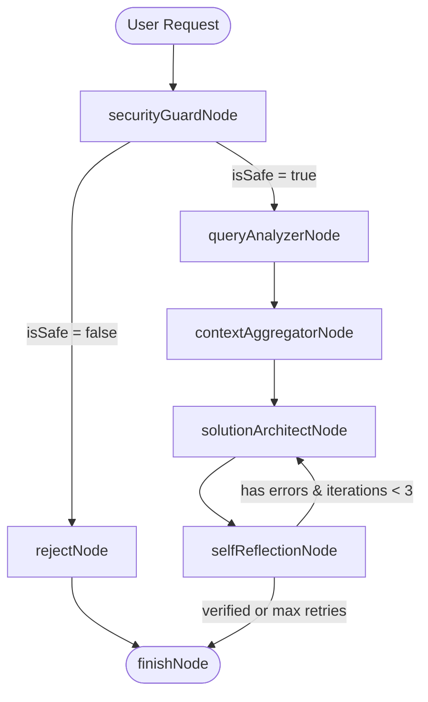

# AGENTS.md — AI Agent & Developer Guidelines for ktor-koog-playground

Welcome to **ktor-koog-playground**! This file serves as the definitive reference guide for AI coding assistants (and human developers) working on this codebase. It documents the project architecture, tech stack, conventions, testing standards, and best practices.

---

## 1. Project Overview & Architecture

**ktor-koog-playground** is a high-performance Kotlin backend showcasing the integration of the **JetBrains Koog AI framework** within a **Ktor 3.x** web application. 

It implements AI-powered features ranging from simple LLM chat and streaming to multi-agent pipelines, non-blocking R2DBC database schema inspection, web research integration, and an autonomous state-machine optimization engine.

### Core Architecture & Package Structure

```
src/main/kotlin/
└── com/aivashin/
    ├── main.kt                                 # Application entry point (io.ktor.server.netty.EngineMain)
    ├── configuration/
    │   ├── AgentModule.kt                      # Main Ktor application module (installs ContentNegotiation, DI, Routing)
    │   ├── dependency/
    │   │   ├── AgentModuleDependencies.kt      # Main Ktor DI configuration
    │   │   ├── DatabaseDependencies.kt         # HikariCP JDBC & R2DBC connection pool & ChatHistoryProvider bindings
    │   │   ├── ToolsDependencies.kt            # ToolRegistry initialization & COMMON_TOOL_REGISTRY_NAME binding
    │   │   └── Utils.kt                        # Helper functions for DI property resolution
    │   ├── properties/
    │   │   └── ServiceProperties.kt            # Strongly typed service configuration models
    │   └── telemetry/
    │       └── TelemetryConfig.kt              # OpenTelemetry & Jaeger tracing setup
    ├── model/
    │   ├── ChatModels.kt                       # DTOs for chat messages and roles
    │   └── graph/
    │       ├── OptimizerNodes.kt               # State-machine graph nodes (Guard, Analyzer, Aggregator, Architect, Audit)
    │       ├── OptimizerState.kt               # Pipeline execution state model (Serializable)
    │       └── OptimizerStrategy.kt            # Koog strategy Graph definition & node transitions
    ├── repository/
    │   ├── ChatHistoryRepository.kt            # Abstract chat history contract
    │   └── InMemoryChatHistoryRepository.kt    # In-memory history implementation for fast testing/dev
    ├── routing/
    │   ├── AgentRouting.kt                     # HTTP endpoints (/llm/chat, /llm/chat/stream, /agent/chat)
    │   ├── OptimizerRouting.kt                 # HTTP endpoints (/optimizer/database)
    │   └── models.kt                           # Request/Response HTTP DTOs (ChatRequest with optional sessionId, ChatResponse)
    ├── service/
    │   ├── agent/
    │   │   └── AgentChatService.kt             # High-level Koog AIAgent with ChatMemory & Event Handling
    │   ├── graph/
    │   │   └── DatabaseOptimizerGraphService.kt# Graph pipeline service with RetryingLLMClient & Telemetry
    │   └── llm/
    │       └── LLMChatService.kt               # Low-level LLM execution, manual tool calling, & SSE streaming
    ├── tool/
    │   └── DatabaseTools.kt                    # Reactive R2DBC introspection tools (GetTableSchemaTool, ListDatabaseTablesTool)
    └── util/
        └── DatabaseUtils.kt                    # Coroutine extension helper for non-blocking ConnectionFactory scoping
```

---

## 2. Tech Stack & Dependencies

- **Language & Runtime**: Kotlin 2.1+, Java 21 Toolchain (`jvmToolchain(21)`).
- **Web Engine**: Ktor 3.x (`ktor-server-core`, `ktor-server-netty`, `ktor-server-content-negotiation`, `ktor-server-di`).
- **AI Agent Framework**: JetBrains Koog (`ai.koog:agents`, `agents-additions`, `agents-features-sql`, `agents-features-chat-history-jdbc`, `agents-features-chat-memory-jdbc`).
- **Database & Reactive Drivers**:
  - PostgreSQL (`org.postgresql:postgresql`) & HikariCP (`com.zaxxer:HikariCP`) for JDBC pooling.
  - R2DBC PostgreSQL (`org.postgresql:r2dbc-postgresql`) & R2DBC Pool (`io.r2dbc:r2dbc-pool`) for reactive, non-blocking tool execution.
  - H2 Database (for in-memory testing).
- **Observability**: OpenTelemetry OTLP & Logging exporters, Jaeger Tracing.
- **Serialization**: `kotlinx.serialization` (JSON).
- **Testing Framework**: JUnit 5, Kotest assertions (`kotest-assertions-core`), MockK (`mockk`), Testcontainers PostgreSQL (`testcontainers-postgresql`), Koog Test Utilities (`koog-agents-test`).

---

## 3. Development Workflow & Commands

### Prerequisites
- JDK 21
- Docker & Docker Compose (for PostgreSQL and Jaeger)
- Google Gemini API Key (`GEMINI_API_KEY`)
- Tavily Search API Key (`TAVILY_API_KEY`, optional for web search)

### Environment Configuration
Copy `.env.example` to `.env` or set environment variables:
```bash
GEMINI_API_KEY=your_gemini_api_key_here
TAVILY_API_KEY=your_tavily_api_key_here
```

### Essential Gradle Commands

| Task | Command | Description |
|------|---------|-------------|
| **Run Application** | `./gradlew run` | Starts Netty server on `http://localhost:8080` |
| **Build Project** | `./gradlew build` | Compiles Kotlin sources and runs all tests |
| **Run Tests** | `./gradlew test` | Executes unit, web, and integration tests |
| **Clean Build** | `./gradlew clean` | Cleans build directory outputs |

### Docker Infrastructure
To start local PostgreSQL database and Jaeger tracing UI:
```bash
docker-compose up -d
```
- **PostgreSQL**: `localhost:5432` (`ktor-koog-playground` DB, user: `postgres`, password: `postgres`)
- **Jaeger Tracing UI**: `http://localhost:16686`

---

## 4. Key AI Capabilities & Pipelines

### A. Low-level LLM Service (`LLMChatService`)
- Direct invocation of `GoogleLLMClient`.
- Uses `prompt("chat-with-tools")` DSL for message context management.
- Handles tool calls manually (`list_database_tables`, `get_table_schema`).
- Supports event streaming (`/llm/chat/stream`) yielding `Flow<StreamFrame>`.

### B. High-level AI Agent (`AgentChatService`)
- Encapsulates `AIAgent` with system instructions and `ToolRegistry`.
- Automatic chat history windowing via `ChatMemory.Feature`.
- Listens to LLM lifecycle events (`onLLMCallCompleted`).

### C. Reactive R2DBC Introspection Tools (`DatabaseTools.kt`)
- `ListDatabaseTablesTool` & `GetTableSchemaTool` use non-blocking R2DBC `ConnectionFactory` via `ConnectionFactory.withConnection { conn -> ... }`.
- Executes SQL queries reactively using Kotlin Coroutines `asFlow()` and `toList()`.

### D. Graph State-Machine Pipeline (`DatabaseOptimizerGraphService`)
Executes an autonomous database optimization pipeline (`optimizerStrategy`) composed of structured graph nodes:



1. `securityGuardNode`: Audits incoming prompt for SQL injection attempts or destructive commands (`DROP`, `DELETE`, `ALTER`, `TRUNCATE`).
2. `queryAnalyzerNode`: Identifies target table names and flags whether external web search is needed.
3. `contextAggregatorNode`: Concurrently fetches live R2DBC table schemas and executes Tavily web searches for PostgreSQL best practices.
4. `solutionArchitectNode`: Formulates candidate SQL script and explanation using structured LLM output (`requestLLMStructured`).
5. `selfReflectionNode`: Audits generated SQL for locking risks, redundancy, or syntax issues; triggers self-correction loop if errors exist.

---

## 5. Coding & Style Conventions for AI Agents

When reading or modifying code in this workspace, strictly observe the following rules:

1. **Dependency Injection**: Always use Ktor DI (`io.ktor.server.plugins.di.*`).
   - In Ktor routes: retrieve services via `val service: MyService by dependencies`.
   - In service constructors: annotate property injections with `@Property("config.path")` or `@Named("beanName")`. Note: `COMMON_TOOL_REGISTRY_NAME` is defined in `ToolsDependencies.kt`.
2. **Structured LLM Output**: When defining structured JSON responses for LLM nodes, use `@Serializable` data classes annotated with `@LLMDescription(...)`.
3. **Immutability & State Propagation**: `OptimizerState` is immutable. Always use `.copy(...)` when updating state across graph nodes.
4. **DTO Design**: `ChatRequest.sessionId` is optional (defaults to `UUID.randomUUID().toString()`). `ChatResponse` always includes both `sessionId` and `reply`.
5. **Non-blocking DB Tools**: Use `ConnectionFactory.withConnection` extension function from `util/DatabaseUtils.kt` when implementing database tools to maintain non-blocking coroutine execution.
6. **Error Handling**: Collect system errors into `ctx.systemErrors` or `validationErrors` instead of throwing unhandled exceptions inside graph nodes.
7. **No Hardcoded Secrets**: Never check in API keys or passwords. Always reference configuration via `application.yaml` placeholders (`$GEMINI_API_KEY`).

---

## 6. Testing Strategy & Guidelines

The repository maintains high test coverage through three distinct testing tiers:

1. **Unit Tests (`com.aivashin.unit.*`)**:
   - Tests individual tools (`DatabaseToolsUnitTest`), repositories (`InMemoryChatHistoryRepositoryTest`), and LLM handlers (`LLMChatServiceUnitTest`).
   - Uses Kotest matchers (`shouldBe`, `shouldContain`) and MockK (`mockk`, `coEvery`).
2. **Web Endpoint Tests (`com.aivashin.web.RoutesWebTest`)**:
   - Validates all HTTP routes (`/llm/chat`, `/llm/chat/stream`, `/agent/chat`, `/optimizer/database`).
   - Mocks application services (`LLMChatService`, `AgentChatService`, `DatabaseOptimizerGraphService`) directly in Ktor DI via `provide<MyService> { mockService }`.
   - Verifies auto-generation of UUID `sessionId` when omitted from request payloads.
   - **No active DB or Docker container required**.
3. **Integration Tests (`com.aivashin.integration.*`)**:
   - `PostgresDatabaseIntegrationTest` & `DatabaseOptimizerGraphServiceIntegrationTest`.
   - Uses **Testcontainers PostgreSQL** (`AbstractPostgresIntegrationTest`) for true database introspection testing.
   - Uses `MockExecutorDSLBuilder.kt` or `getMockExecutor` to mock deterministic LLM responses while testing graph state transitions.

### How to Run Tests
```bash
# Run all tests
./gradlew test

# Run a specific test class
./gradlew test --tests "com.aivashin.web.RoutesWebTest"
```

---

## 7. Bruno API Collection

The repository includes a ready-to-use **Bruno API collection** in the `bruno/` directory:
- `LLM Chat.bru`: `POST http://localhost:8080/llm/chat`
- `LLM Chat Stream.bru`: `POST http://localhost:8080/llm/chat/stream`
- `Agent Chat.bru`: `POST http://localhost:8080/agent/chat`
- `Database Optimizer.bru`: `POST http://localhost:8080/optimizer/database`

Simply open Bruno and point it to the `bruno/` directory to start interacting with the API!

## graphify

This project has a knowledge graph at graphify-out/ with god nodes, community structure, and cross-file relationships.

When the user types `/graphify`, use the installed graphify skill or instructions before doing anything else.

Rules:
- For codebase questions, first run `graphify query "<question>"` when graphify-out/graph.json exists. Use `graphify path "<A>" "<B>"` for relationships and `graphify explain "<concept>"` for focused concepts. These return a scoped subgraph, usually much smaller than GRAPH_REPORT.md or raw grep output.
- Dirty graphify-out/ files are expected after hooks or incremental updates; dirty graph files are not a reason to skip graphify. Only skip graphify if the task is about stale or incorrect graph output, or the user explicitly says not to use it.
- If graphify-out/wiki/index.md exists, use it for broad navigation instead of raw source browsing.
- Read graphify-out/GRAPH_REPORT.md only for broad architecture review or when query/path/explain do not surface enough context.
- After modifying code, run `graphify update .` to keep the graph current (AST-only, no API cost).
