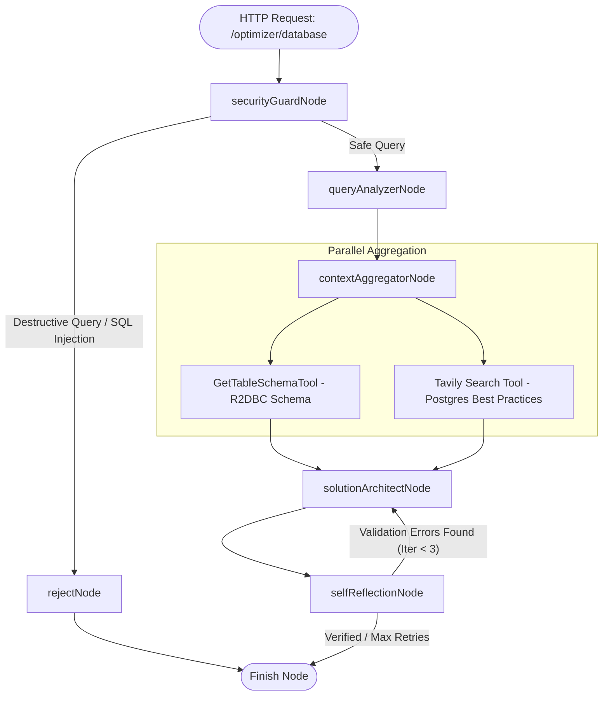

<div align="center">

# 🚀 Ktor Koog Playground

**A State-of-the-Art Reactive Kotlin Backend Demonstrating JetBrains Koog AI Integration & Multi-Agent Database Optimization**

[](https://kotlinlang.org/)
[](https://ktor.io/)
[](https://github.com/JetBrains/koog)
[](https://www.jaegertracing.io/)

---

*Explore low-level LLM execution, SSE streaming, autonomous AI agents with chat memory, reactive R2DBC database introspection, and self-correcting graph state-machines integrated directly into Ktor.*

</div>

<!-- TOC -->
* [🚀 Ktor Koog Playground](#-ktor-koog-playground)
  * [🌟 Overview](#-overview)
  * [✨ Key Features](#-key-features)
  * [🏗️ System Architecture & Graph Pipeline](#-system-architecture--graph-pipeline)
  * [🚀 Getting Started](#-getting-started)
    * [Prerequisites](#prerequisites)
    * [Environment Setup](#environment-setup)
    * [Spin Up Infrastructure](#spin-up-infrastructure)
    * [Building & Running](#building--running)
  * [📡 API Documentation](#-api-documentation)
    * [1. Simple LLM Chat](#1-simple-llm-chat)
    * [2. LLM Server-Sent Events (SSE) Streaming](#2-llm-server-sent-events-sse-streaming)
    * [3. High-Level AI Agent Chat](#3-high-level-ai-agent-chat)
    * [4. Database Optimization Engine](#4-database-optimization-engine)
  * [🧪 Testing & Quality Assurance](#-testing--quality-assurance)
    * [Test Suites Architecture](#test-suites-architecture)
  * [📊 Observability & Tracing](#-observability--tracing)
  * [📂 Project Structure](#-project-structure)
  * [🧰 Bruno API Collection](#-bruno-api-collection)
<!-- TOC -->

## 🌟 Overview

**ktor-koog-playground** is a production-grade Kotlin reference architecture built on **Ktor 3.x** and **JetBrains Koog AI Framework**. It demonstrates how to build resilient, multi-agent AI systems backed by reactive R2DBC database introspection, automated security guardrails, external web research, and distributed OpenTelemetry tracing.

Whether you're exploring direct LLM execution via prompt DSLs, Server-Sent Events (SSE) streaming, or building self-correcting graph pipelines, this project provides a comprehensive template.

---

## ✨ Key Features

| Feature | Technology / Component | Description |
|:---|:---|:---|
| 🤖 **JetBrains Koog AI Integration** | `ai.koog:agents` | Deep integration with Koog `LLMClient`, `AIAgent`, `ToolRegistry`, and `ChatMemory`. |
| ⚡ **Reactive Ktor 3.x Backend** | Ktor + Netty | Asynchronous REST backend featuring ContentNegotiation (JSON) and Ktor Dependency Injection. |
| 🔄 **SSE Event Streaming** | `Flow<StreamFrame>` | Real-time token-by-token text streaming over HTTP SSE via `/llm/chat/stream`. |
| ⚡ **Reactive R2DBC Tools** | `r2dbc-pool` + Kotlin Coroutines | Non-blocking database table & schema introspection using R2DBC drivers and coroutines `Flow`. |
| 📊 **Autonomous DB Optimizer Pipeline** | `optimizerStrategy` | Multi-node state-machine graph (`SecurityGuard` ➔ `QueryAnalyzer` ➔ `ContextAggregator` ➔ `SolutionArchitect` ➔ `SelfReflection` audit loop). |
| 🛡️ **Built-in Security Guardrails** | `securityGuardNode` | Automatic detection and rejection of SQL injections or destructive operations (`DROP`, `DELETE`, `ALTER`, `TRUNCATE`). |
| 🔍 **Parallel Context Aggregation** | Kotlin Coroutines | Concurrent fetching of live PostgreSQL table schemas via R2DBC and Tavily web research. |
| 📈 **Observability & Tracing** | OpenTelemetry + Jaeger | Complete execution trajectory tracing across agents, prompt executions, and tool calls. |
| 🧪 **Enterprise Test Suite** | JUnit 5 + Testcontainers | Comprehensive test suite including unit tests, isolated Ktor `testApplication` web tests, and PostgreSQL integration tests. |

---

## 🏗️ System Architecture & Graph Pipeline

The **Database Optimizer Engine** operates as an autonomous state-machine pipeline that analyzes SQL queries, inspects the live database schema via non-blocking R2DBC queries, researches best practices on the web, generates optimized SQL, and audits the results for safety.



---

## 🚀 Getting Started

### Prerequisites

Ensure you have the following installed on your local machine:
- **JDK 21** or higher
- **Docker** & **Docker Compose**
- **Google Gemini API Key** ([Get key here](https://aistudio.google.com/))
- **Tavily Search API Key** *(Optional, for web search capabilities)*

### Environment Setup

Create a `.env` file in the root directory (or set environment variables):

```bash
# .env
GEMINI_API_KEY=your_google_gemini_api_key_here
TAVILY_API_KEY=your_tavily_search_api_key_here
```

### Spin Up Infrastructure

Launch PostgreSQL 18 and Jaeger Tracing UI using Docker Compose:

```bash
docker-compose up -d
```

Verifying services:
- **PostgreSQL**: Running on `localhost:5432` (`ktor-koog-playground`)
- **Jaeger UI**: Accessible at `http://localhost:16686`

### Building & Running

Start the Ktor backend application:

```bash
./gradlew run
```

Upon success, the Netty server will log:
```
INFO Application - Responding at http://0.0.0.0:8080
```

---

## 📡 API Documentation

> 💡 **Note**: `sessionId` is optional in request bodies. If omitted, the server automatically generates a unique UUID string for the session.

### 1. Simple LLM Chat

Sends a message to the Google Gemini LLM using Koog's low-level execution client and manual tool resolution.

- **Endpoint**: `POST /llm/chat`
- **Content-Type**: `application/json`

**Request**:
```json
{
  "sessionId": "session-101",
  "message": "What database tables are available in the system?"
}
```

**Response**:
```json
{
  "sessionId": "session-101",
  "reply": "The database contains the following tables: users, orders, products."
}
```

---

### 2. LLM Server-Sent Events (SSE) Streaming

Streams the LLM's response token-by-token in real time using HTTP SSE.

- **Endpoint**: `POST /llm/chat/stream`
- **Content-Type**: `application/json`

**Request**:
```json
{
  "sessionId": "session-102",
  "message": "Explain how database indexing works in PostgreSQL."
}
```

**cURL Example**:
```bash
curl -N -X POST http://localhost:8080/llm/chat/stream \
  -H "Content-Type: application/json" \
  -d '{"sessionId": "stream-1", "message": "Explain database indexes"}'
```

---

### 3. High-Level AI Agent Chat

Interacts with a stateful `AIAgent` equipped with conversation memory (`ChatMemory`) and tool execution capabilities.

- **Endpoint**: `POST /agent/chat`
- **Content-Type**: `application/json`

**Request**:
```json
{
  "sessionId": "session-103",
  "message": "Can you check the schema for the users table?"
}
```

**Response**:
```json
{
  "sessionId": "session-103",
  "reply": "The `users` table schema: id (UUID), email (VARCHAR), created_at (TIMESTAMP)."
}
```

---

### 4. Database Optimization Engine

Runs the multi-node state-machine graph pipeline to audit, research, and optimize database queries.

- **Endpoint**: `POST /optimizer/database`
- **Content-Type**: `application/json`

**Request**:
```json
{
  "message": "SELECT * FROM users WHERE email = 'test@example.com' ORDER BY created_at DESC"
}
```

**Response Example**:
```json
{
  "sessionId": "b8f5a1c2-3e4f-4a5b-9c8d-7e6f5a4b3c2d",
  "reply": "### Verification Status: SUCCESS (Verified after 1 iterations)\n\n### Optimized SQL:\n```sql\nCREATE INDEX idx_users_email_created_at ON users (email, created_at DESC);\n```\n\n### Technical Explanation:\nCreating a composite index on (email, created_at DESC) eliminates sequential table scans and avoids an explicit sort step."
}
```

---

## 🧪 Testing & Quality Assurance

The codebase includes comprehensive unit, web, and integration test coverage:

```bash
# Execute all test suites
./gradlew test
```

### Test Suites Architecture

1. **Unit Tests (`com.aivashin.unit.*`)**:
   - `DatabaseToolsUnitTest`: Verifies R2DBC schema introspection tools.
   - `LLMChatServiceUnitTest`: Validates LLM service behavior.
   - `InMemoryChatHistoryRepositoryTest`: Tests conversation persistence.
2. **Web Tests (`com.aivashin.web.RoutesWebTest`)**:
   - Tests all HTTP endpoints using Ktor's `testApplication` engine.
   - Mocks Ktor services in Ktor DI (`provide<LLMChatService>`, etc.).
   - Verifies auto-generation of UUID session IDs when omitted from requests.
   - **Runs rapidly without requiring external databases or Docker containers.**
3. **Integration Tests (`com.aivashin.integration.*`)**:
   - `PostgresDatabaseIntegrationTest` & `DatabaseOptimizerGraphServiceIntegrationTest`.
   - Uses **Testcontainers PostgreSQL** for real database introspection.
   - Verifies graph state machine transitions and audit retry loops using deterministic `MockExecutorDSLBuilder`.

---

## 📊 Observability & Tracing

All agent execution pipelines, prompt executions, and tool calls are traced using **OpenTelemetry** and exportable directly to **Jaeger**.

1. Start Jaeger via `docker-compose up -d`.
2. Run an optimization request via `/optimizer/database`.
3. Open `http://localhost:16686` in your browser to view full trace trajectories, span timings, and LLM prompt payloads.

---

## 📂 Project Structure

```
ktor-koog-playground/
├── bruno/                                  # Bruno API Collection for HTTP testing
├── docker-compose.yaml                     # PostgreSQL 18 & Jaeger Docker setup
├── build.gradle.kts                        # Gradle dependencies & Kotlin configuration
├── AGENTS.md                               # AI Agent & Developer instruction guide
├── README.md                               # Project README documentation
├── src/
│   ├── main/
│   │   ├── kotlin/com/aivashin/
│   │   │   ├── configuration/              # Ktor Module, DI, & Telemetry setup
│   │   │   ├── model/                      # Graph state machine & Chat models
│   │   │   ├── repository/                 # Chat history persistence layer
│   │   │   ├── routing/                    # Ktor HTTP Routing controllers
│   │   │   ├── service/                    # LLM, AIAgent, & Graph Optimizer services
│   │   │   ├── tool/                       # R2DBC Reactive Database Introspection tools
│   │   │   └── util/                       # Coroutine ConnectionFactory extensions
│   │   └── resources/                      # application.yaml & logback.xml
│   └── test/
│       └── kotlin/com/aivashin/
│           ├── integration/                # Testcontainers PostgreSQL Integration tests
│           ├── unit/                       # Kotest Unit tests
│           └── web/                        # Ktor testApplication Web HTTP tests
```

---

## 🧰 Bruno API Collection

A ready-to-use **Bruno API collection** is included in the `bruno/` directory:

1. Download and install [Bruno](https://www.usebruno.com/).
2. Open Bruno and select **Open Collection**.
3. Choose the `bruno/` folder in this repository.
4. Execute pre-configured HTTP requests for `/llm/chat`, `/llm/chat/stream`, `/agent/chat`, and `/optimizer/database`.

---

<div align="center">

Crafted with ❤️ using **Kotlin**, **Ktor**, **R2DBC**, and **JetBrains Koog AI**.

</div>
